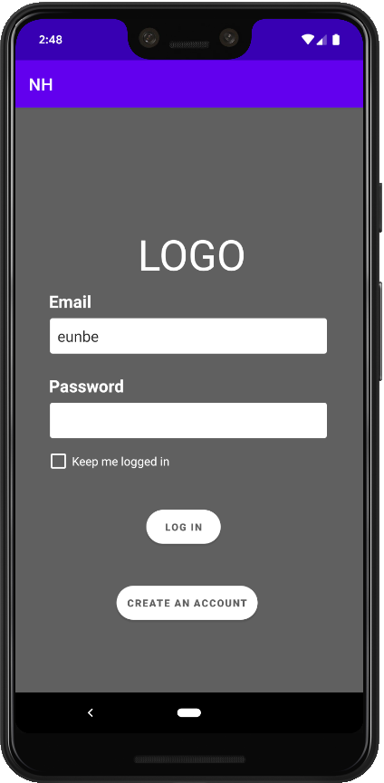
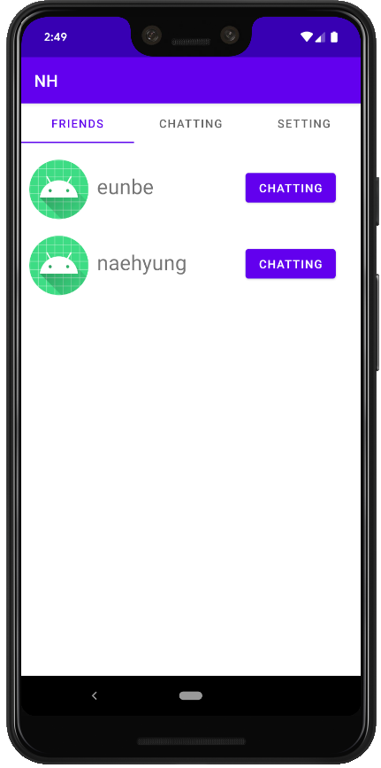
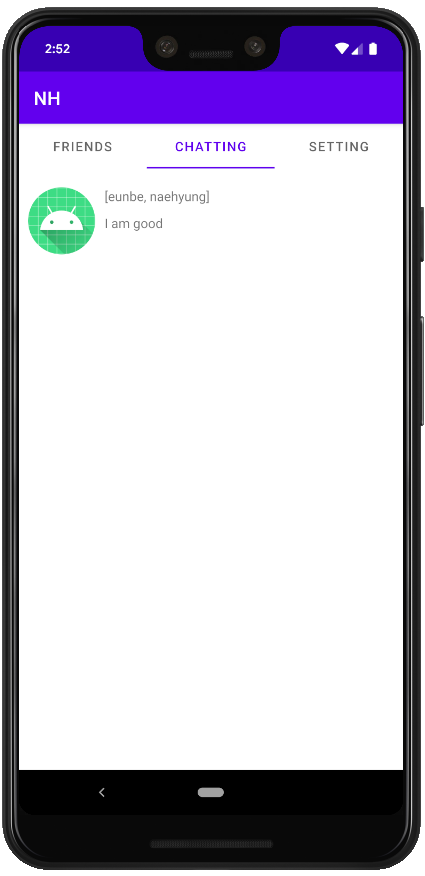
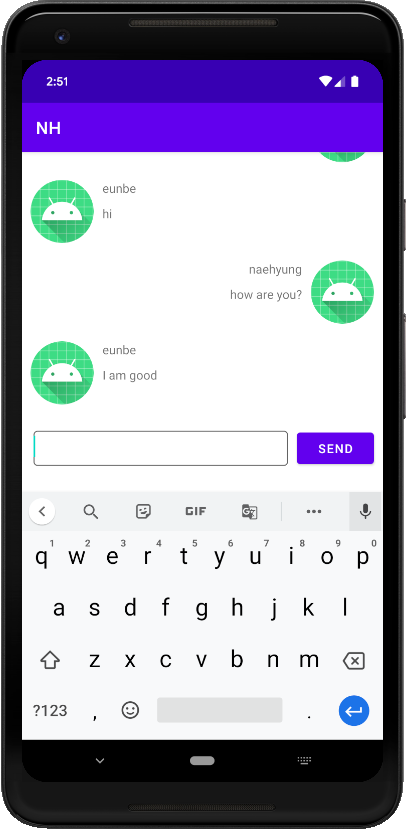
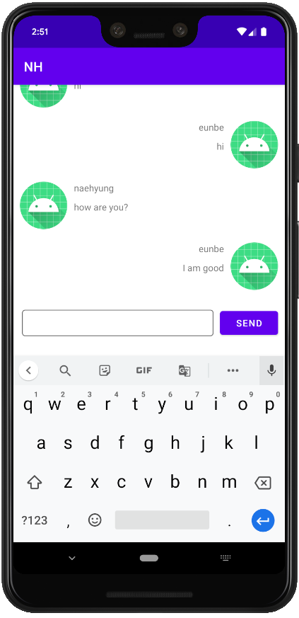

# Simple-Chatting-Application
Simple chatting application using Restful API, WebSocket, Stomp, and SQL in java.

Check Server https://github.com/Naehyung/Simple-Chatting-Application-Server

## Features
- User Login.
- Create an user.
- Create a chatting room.
- Chatting with other users.
- Save and Update all the data automatically in the database.

## Usage Examples

